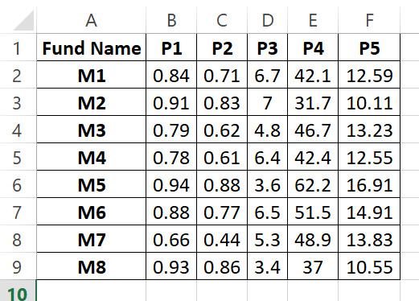
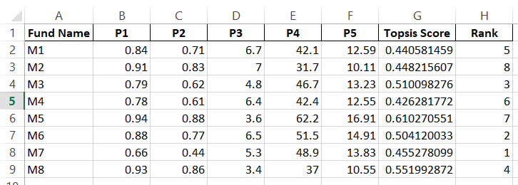

# 📌 Implementation of TOPSIS in Python (Command Line Program)

---

## 📖 1. Introduction

TOPSIS (Technique for Order Preference by Similarity to Ideal Solution) is a Multi-Criteria Decision Making (MCDM) technique used to rank alternatives based on their distance from an ideal solution.

The fundamental principle of TOPSIS is:
- The best alternative should have the **shortest distance from the Ideal Best Solution**
- The best alternative should have the **largest distance from the Ideal Worst Solution**

This assignment implements the TOPSIS algorithm in Python as a **Command Line Program**, strictly following all specified instructions and validation requirements.

---

## 🎯 2. Objective

The objectives of this assignment are:

- To implement the TOPSIS algorithm in Python
- To create a command-line interface for execution
- To validate user inputs properly
- To handle exceptions such as file not found and invalid inputs
- To generate an output file containing TOPSIS Score and Rank

---

## 🖥️ 3. Command Line Usage

### 🔹 Syntax

```bash
python <program.py> <InputDataFile> <Weights> <Impacts> <OutputResultFileName>
```

### 🔹 Example

```bash
python topsis.py data.xlsx "1,1,1,2,2" "+,+,-,+,-" result.xlsx
```

### 🔹 Parameters Description

| Parameter | Description |
|------------|------------|
| InputDataFile | CSV or XLSX file containing decision matrix |
| Weights | Comma-separated numeric values |
| Impacts | Comma-separated values of '+' or '-' |
| OutputResultFileName | Name of output result file |

---

## 📂 4. Input File Format

The input file must satisfy the following conditions:

- Must contain **at least 3 columns**
- First column → Alternative names (non-numeric)
- From 2nd to last columns → Numeric criteria values only

### 📸 Input File Screenshot



---

## 🧠 5. Detailed Methodology

The TOPSIS algorithm is implemented using the following steps:

---

### Step 1: Construct the Decision Matrix

The input file is read and converted into a matrix format:

- Rows → Alternatives
- Columns → Criteria

---

### Step 2: Normalize the Decision Matrix

Each value in the decision matrix is normalized using vector normalization:

rij = xij / √( Σ xij² )

This normalization ensures that:
- All criteria become dimensionless
- Values are comparable across different scales

---

### Step 3: Calculate Weighted Normalized Matrix

Each normalized value is multiplied by its corresponding weight:

vij = rij × wj

This step produces the **weighted normalized decision matrix**, reflecting the importance of each criterion.

---

### Step 4: Determine Ideal Best and Ideal Worst

For each criterion:

- If impact is **+ (Benefit Criterion)**:
  - Ideal Best = Maximum value
  - Ideal Worst = Minimum value

- If impact is **- (Cost Criterion)**:
  - Ideal Best = Minimum value
  - Ideal Worst = Maximum value

---

### Step 5: Calculate Separation Measures

Distance from Ideal Best:

Si+ = √ Σ (vij − vj+)²

Distance from Ideal Worst:

Si− = √ Σ (vij − vj−)²

---

### Step 6: Calculate TOPSIS Score

The TOPSIS score (Ci) is calculated using:

Ci = Si− / (Si+ + Si−)

Where:
- Si+ → Separation from Ideal Best
- Si− → Separation from Ideal Worst
- 0 ≤ Ci ≤ 1
- Higher value of Ci indicates better performance

---

### Step 7: Ranking

- Alternatives are ranked in descending order of TOPSIS Score
- Highest score → Rank 1

---

## 📊 6. Output Format

The output file contains:

- Original input data
- TOPSIS Score column
- Rank column

### 📸 Output Result Screenshot



---

## ✅ 7. Input Validation and Error Handling

The program validates the following conditions:

✔ Correct number of command-line arguments  
✔ File Not Found exception handling  
✔ Input file must contain at least 3 columns  
✔ From 2nd to last columns must contain numeric values only  
✔ Number of weights must equal number of criteria  
✔ Number of impacts must equal number of criteria  
✔ Impacts must be either '+' or '-'  
✔ Weights and impacts must be comma-separated  

If any condition fails, an appropriate error message is displayed.

---

## 📁 8. Project Structure

```
Part-I-TOPSIS/
│
├── topsis.py
├── README.md
└── screenshots/
    ├── data.png
    └── topsis_result.png
```

---

## 🛠 9. Technologies Used

- Python 3.x
- Pandas
- NumPy
- OpenPyXL

---

## 📌 10. Conclusion

This project successfully implements the TOPSIS method as a command-line program with full validation and exception handling.  

All assignment requirements have been satisfied, including:

- Command-line interface
- Proper input validation
- Exception handling
- Correct implementation of TOPSIS methodology
- Output file generation with ranking

The program accurately ranks alternatives based on multiple criteria using the TOPSIS decision-making approach.

---

## 👩‍🎓 Author

**Palak**
