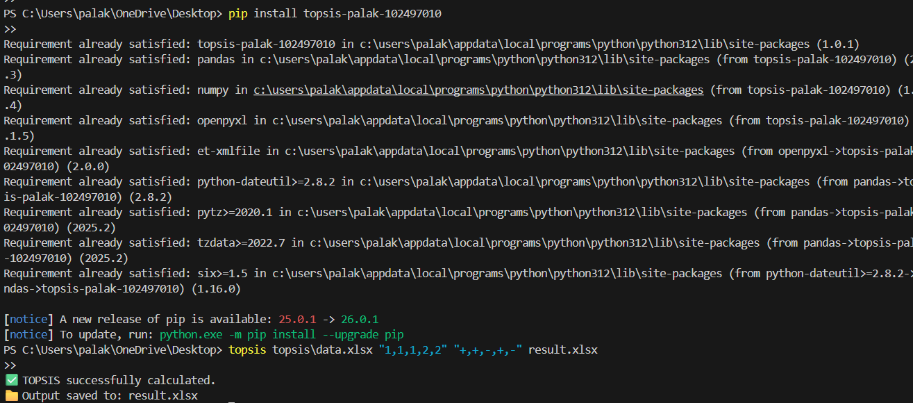

# TOPSIS Python Package  
## Topsis-Palak-102497010

---

## 📌 Overview

This project is a Python implementation of the **TOPSIS (Technique for Order Preference by Similarity to Ideal Solution)** method.  
The project has been developed as a **Python package**, uploaded to **PyPI**, and can be executed directly using the **command line interface**.

TOPSIS is a widely used **Multi-Criteria Decision Making (MCDM)** technique that ranks alternatives based on their closeness to an ideal best solution and distance from an ideal worst solution.

---

## 📦 Package Information

- **Package Name:** topsis-palak-102497010  
- **Author:** Palak  
- **Roll Number:** 102497010  
- **Version:** 1.0.1  

🔗 **PyPI Package Link:**  
https://pypi.org/project/topsis-palak-102497010/

---

## 🎯 Assignment Objectives

This assignment required:

- Implementation of TOPSIS algorithm in Python  
- Development of a command-line program  
- Creation of a Python package  
- Uploading the package to PyPI  
- Providing a user manual (README)  
- Testing installation and execution via command line  

All objectives have been successfully completed.

---

## 🧠 Methodology – TOPSIS Algorithm

The TOPSIS method follows the steps below:

---

### Step 1: Decision Matrix Construction

The input file (CSV or Excel) must contain:
- First column → Alternatives
- Remaining columns → Criteria values

Example:

| Alternative | C1 | C2 | C3 |
|------------|----|----|----|
| A1 | 250 | 16 | 12 |
| A2 | 200 | 20 | 8  |

---

### Step 2: Normalization of Decision Matrix

Each value is normalized using vector normalization:

rᵢⱼ = xᵢⱼ / √(Σ xᵢⱼ²)

This ensures all criteria become dimensionless and comparable.

---

### Step 3: Weighted Normalized Matrix

Each normalized value is multiplied by its respective weight:

vᵢⱼ = rᵢⱼ × wⱼ

---

### Step 4: Determine Ideal Best and Ideal Worst

For each criterion:

If impact is **"+"** (benefit):
- Ideal Best (V⁺) = maximum value
- Ideal Worst (V⁻) = minimum value

If impact is **"-"** (cost):
- Ideal Best (V⁺) = minimum value
- Ideal Worst (V⁻) = maximum value

---

### Step 5: Separation Measures

Distance from Ideal Best:

Sᵢ⁺ = √(Σ (vᵢⱼ − Vⱼ⁺)²)

Distance from Ideal Worst:

Sᵢ⁻ = √(Σ (vᵢⱼ − Vⱼ⁻)²)

---

### Step 6: TOPSIS Score Calculation

Cᵢ = Sᵢ⁻ / (Sᵢ⁺ + Sᵢ⁻)

Higher value of Cᵢ indicates a better alternative.

---

## 💻 Installation

Install the package directly from PyPI:

```bash
pip install topsis-palak-102497010

---

## ▶️ Command Line Usage

```bash
topsis <InputDataFile> <Weights> <Impacts> <OutputFileName>
```

### Example
```bash
topsis data.xlsx "1,1,1,2,2" "+,+,-,+,-" result.xlsx
```

---

## 📂 Input File Requirements

- Minimum **3 columns**
- First column → Alternative names
- Remaining columns → Numeric values only
- Weights must be comma-separated numbers
- Impacts must be `+` or `-`
- Number of weights = Number of criteria
- Number of impacts = Number of criteria

---

## 📊 Output Description

The output file contains:
- Original input data
- **TOPSIS Score**
- **Rank**

Higher TOPSIS score indicates better performance.

---

## ✅ Validation & Error Handling

The package validates:

✔ Correct number of arguments  
✔ File existence  
✔ Numeric criteria values  
✔ Matching weights and impacts count  
✔ Valid impact symbols (`+` or `-`)  
✔ Proper comma-separated inputs  

Clear error messages are shown for invalid inputs.

---


### PyPI Package Page


### Package Installation and Execution


---

## 🧪 Testing

The package was tested by:
- Installing from PyPI
- Running via command line
- Verifying output generation
- Checking ranking correctness

---

## 🧰 Technologies Used

- Python 3.x
- Pandas
- NumPy
- OpenPyXL
- setuptools
- twine

---

## 📌 Conclusion

This project successfully demonstrates:
- Development of a Python package
- Publishing to PyPI
- Command-line execution
- Proper documentation and testing
- Correct implementation of TOPSIS methodology

All assignment requirements have been fulfilled.

---

## 👩‍🎓 Author

**Palak**  


