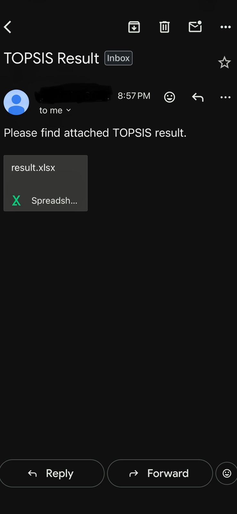
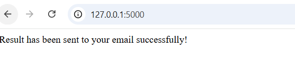
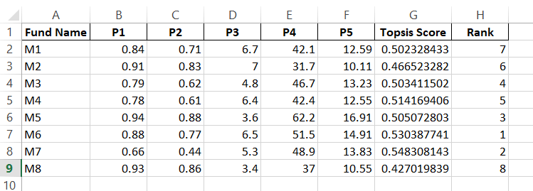

# TOPSIS Web Application 

This assignment implements a Flask-based web application for the **TOPSIS** (Technique for Order of Preference by Similarity to Ideal Solution) method. The application allows users to upload a decision matrix, input criteria weights and impacts, calculate TOPSIS scores, generate a results file, and receive the results via email.

---

## Project Structure
```
TOPSIS-WEB-SERVICE/
│
├── app.py          - Main Flask application
├── topsis.py       - TOPSIS calculation module
├── uploads/        - Folder to store uploaded files
├── result.xlsx     - Generated TOPSIS result file
├── templates/
│   └── index.html  - HTML template for the web interface
├── Screenshots/
│   ├── data.png    - Screenshot of data upload
│   ├── mail.jpeg   - Screenshot of email sent
│   ├── notify.png  - Screenshot of notification
│   └── result.png  - Screenshot of TOPSIS result
└── README.md
```

---

## Methodology

1. **File Upload:** Users upload an Excel file containing alternatives and criteria.
2. **Input Parameters:** Users enter weights (comma-separated numbers) and impacts (comma-separated `+` or `-` for benefit/cost).
3. **Validation:**
   - Number of weights must equal number of impacts.
   - Impacts must only contain `+` or `-`.
   - Email must be in a valid format.
4. **TOPSIS Calculation:** The uploaded file is processed using `topsis.py`, computing scores and ranking the alternatives.
5. **Result Generation:** A `result.xlsx` file is created with the rankings.
6. **Email Notification:** The generated results file is automatically sent to the provided email address.

---

## Results

Users receive a ranked alternatives list in `result.xlsx`. The web app shows a confirmation that the results have been emailed.

---

## Screenshots

### 1. Data Upload


### 2. Email Notification


### 3. Result Notification


### 4. Generated TOPSIS Result


---

## Usage

1. Navigate to the `TOPSIS-WEB-SERVICE` folder.
2. Install dependencies:
```bash
   pip install flask pandas openpyxl
```
3. Run the application:
```bash
   python app.py
```
4. Open the web app in your browser at [http://127.0.0.1:5000/](http://127.0.0.1:5000/)
5. Upload your decision matrix, enter weights, impacts, and email.
6. Download `result.xlsx` or check your email for results.

---

## Notes

- Update email credentials in `app.py` before using the email feature.
- Ensure weights and impacts have the same number of elements.
- Impacts can only contain `+` or `-`.

---

## Author

PALAK
